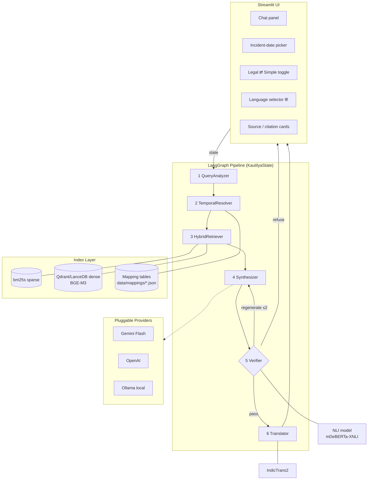
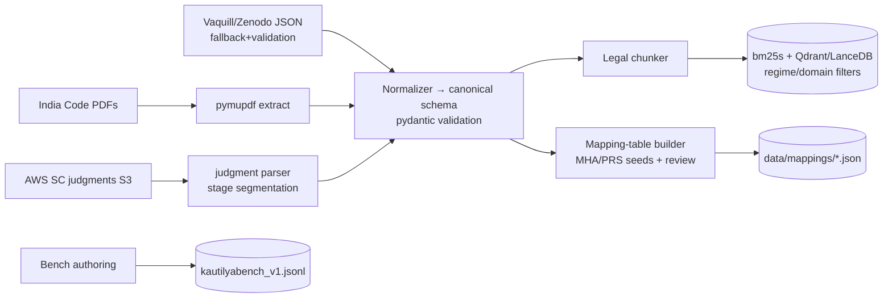

# ARCHITECTURE.md — Project Kautilya

System architecture, diagrams, and component contracts. Read with `PROJECT_PLAN.md`.

---

## 1. High-Level System



## 2. Request Lifecycle (happy path)

1. User asks (any of 7 languages): *"March 2024 mein cheating hui thi — kaunsa section?"*
2. **QueryAnalyzer** detects `input_lang=hi`, classifies domains `[criminal_substantive]`,
   resolves incident_date `2024-03-XX`, extracts entities (`cheating`).
3. **TemporalResolver**: `2024-03 < 2024-07-01` ⇒ regime=`old` ⇒ search IPC/CrPC/Evidence Act
   shards; loads mapping row → will surface `IPC s.420 ≈ BNS s.318(4)`.
4. **HybridRetriever**: BM25 + BGE-M3 dense on the *old-regime criminal* partition → RRF →
   rerank → top-k spans.
5. **Synthesizer** (pluggable LLM) emits:
   - Legal register: "Under IPC s.420 … punishment up to 7 years [IPC_1860_s420]."
   - Simple register: "Cheating someone of money was punished under IPC section 420…"
   - Equivalence note from mapping table.
6. **Verifier**: regex-extracts each citation → checks the cited span exists in retrieved
   context; NLI checks each claim against its span. Unsupported claim ⇒ regenerate (≤2)
   ⇒ else refuse-with-sources.
7. **Translator**: IndicTrans2 translates ONLY the Simple register to Hindi; citations
   untouched. UI renders both registers, source cards, disclaimer.

## 3. Data Pipeline (offline)



### Chunking rules (section-aware — ablation baseline vs naive 512-token)
- One chunk = one section (or article); provisos/illustrations/clauses stay attached.
- Prepend context header: `[Act | Chapter | Section no | Title | regime | effective window]`
  (mitigates Document-Level Retrieval Mismatch).
- Judgments: split by case_stage headings; header carries court/date/citation.
- Max chunk ≈ 1200 tokens; oversized sections split at clause boundaries only.

## 4. LangGraph Contracts

Typed state (`src/kautilya/graph/state.py`):

```python
class KautilyaState(TypedDict):
    query_raw: str
    input_lang: str                    # detected ISO code
    domains: list[str]                 # 0..6 of the fixed domain enum
    entities: dict                     # sections, case cites, keywords
    incident_date: date | None
    needs_date: bool                   # True if temporal question without a date
    regimes: list[RegimeSelection]     # per-domain old/new/current + rationale
    equivalences: list[Equivalence]    # mapping-table hits to surface
    retrieved: list[Span]              # scored, deduped, with provenance
    answer_legal: str | None
    answer_simple: str | None
    citations: list[Citation]          # {claim_id, span_id, quote}
    verification: VerificationReport   # per-claim status
    retries: int
    final_lang: str
    answer_translated: str | None
    route: Literal["answer", "ask_date", "refuse", "out_of_scope"]
```

Node signatures (all pure `(state) -> dict` partial updates):

| Node | Input reads | Writes | Failure mode |
|---|---|---|---|
| QueryAnalyzer | query_raw | input_lang, domains, entities, incident_date, needs_date, final_lang | LLM down → keyword fallback classifier |
| TemporalResolver | domains, incident_date, needs_date | regimes, equivalences, `route="ask_date"?` | unknown date logic → current law + note |
| HybridRetriever | query_raw(+en gloss), regimes | retrieved | empty → relax filters once |
| Synthesizer | query, retrieved, equivalences, final_lang target registers | answer_legal, answer_simple, citations | — |
| Verifier | answers, citations, retrieved | verification, retries, `route="refuse"/"regenerate"` | NLI down → citation-existence check only |
| Translator | answer_simple, final_lang | answer_translated | IndicTrans2 down → LLM-translate flag |

Graph edges: `analyzer→resolver→retriever→synthesizer→verifier`;
`verifier --pass--> translator --done--> END`;
`verifier --regenerate(retries<2)--> synthesizer`;
`verifier --refuse--> END`; conditional `resolver --needs_date--> END(ask user)`.

## 5. Index Design

| Collection | Contents | Payload filters |
|---|---|---|
| `statutes_{domain}` | section chunks | `act_short, regime, effective_from/to, section_no` |
| `judgments` | case_stage chunks | `court, decision_date, domain_tags[]` |

- Dense: BGE-M3 (1024-d), cosine, HNSW.
- Sparse: bm25s over same chunks, shared chunk IDs for RRF fusion.
- Regime filtering happens at query time via payload filter — one index serves all dates.

## 6. Config Schema (`config/settings.yaml`)

```yaml
llm: {provider: gemini, model: gemini-2.0-flash, temperature: 0.1}
embeddings: {model: BAAI/bge-m3}
reranker: {model: BAAI/bge-reranker-v2-m3, enabled: true}
retrieval: {dense_k: 20, sparse_k: 20, rrf_k: 60, final_k: 8}
verifier: {nli_model: MoritzLaurer/mDeBERTa-v3-base-xnli-multilingual-nli,
           threshold: 0.75, max_regen: 2}
temporal:
  cutoffs: {criminal_substantive: 2024-07-01, criminal_procedure: 2024-07-01,
            evidence: 2024-07-01, labour: 2025-11-21, tax: 2026-04-01}
languages: [en, hi, mr, bn, ta, te, gu, kn]
translate: {engine: indictrans2, fallback_llm: true}
ui: {page_title: Kautilya}
```

## 7. Security & Compliance Notes

- `.env` gitignored; keys loaded via pydantic-settings only.
- No query logging by default (`telemetry.enabled: false`).
- Government-published law texts are freely accessible; judgment corpus is CC-BY-4.0 —
  attribution file shipped in `data/raw/ATTRIBUTION.md`.
- Disclaimer banner rendered on every response (UI-level, not just prompt-level).

## 8. Paper-Ready Experiment Map

| Figure/Table in paper | Produced by |
|---|---|
| T1 system comparison vs prior work | manual lit table (PROJECT_PLAN §2) |
| T2 retrieval ablation (BM25/dense/hybrid/+rerank) | eval runner × retrieval config |
| T3 chunking ablation | eval runner × chunker config |
| T4 USP-1 value: regime-filter on/off temporal accuracy | eval runner |
| T5 verifier: faithfulness & false-citation catch rate | seeded tests + bench |
| T6 readability: grade level legal vs simple register | textstat over bench outputs |
| F1/F2 mermaid diagrams above | exported as PNG/SVG |
